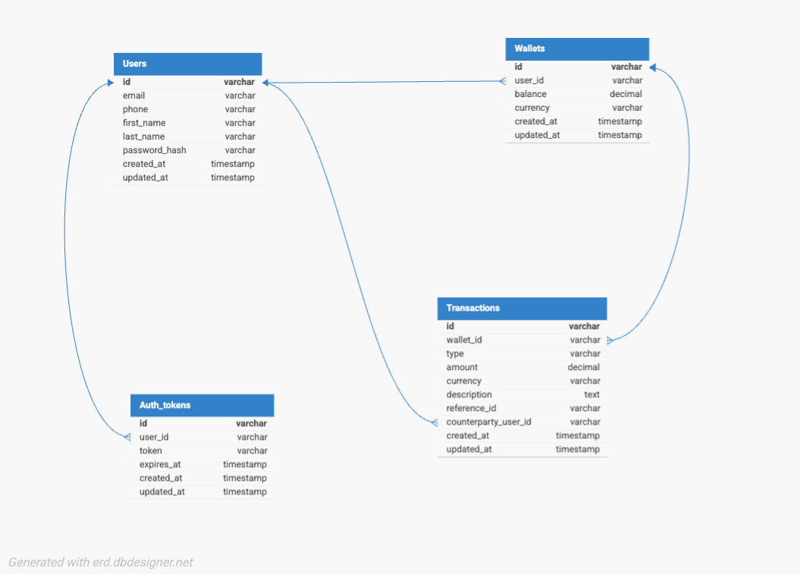

# Demo Credit - Wallet Service MVP

A Node.js/TypeScript wallet service for the Lendsqr Backend Engineering Assessment. Implements wallet functionality for a mobile lending app: account creation, funding, transfers, and withdrawals—with Karma blacklist integration to prevent onboarding of blacklisted users.

**Submission document (design rationale, decisions, and links):** [Samuel Aleonomoh – Lendsqr Backend Engineering Assessment](https://docs.google.com/document/d/1YaNzQiN7zxpjyGcdOUV95vUVEcyrLTlZrBno8DSd3U4/edit?usp=sharing)

---

## Table of Contents

- [Submission Document](#submission-document)
- [Tech Stack](#tech-stack)
- [Features](#features)
- [Design Document](#design-document)
- [E-R Diagram](#e-r-diagram)
- [Getting Started](#getting-started)
- [API Reference](#api-reference)
- [Testing](#testing)
- [Project Structure](#project-structure)
- [Architecture Decisions](#architecture-decisions)

---

## Submission Document

A detailed write-up of the implementation, design decisions, and deployment is available here:

**[Samuel Aleonomoh – Lendsqr Backend Engineering Assessment](https://docs.google.com/document/d/1YaNzQiN7zxpjyGcdOUV95vUVEcyrLTlZrBno8DSd3U4/edit?usp=sharing)** (Google Docs)

---

## Tech Stack

| Technology | Purpose |
|------------|---------|
| **Node.js** (LTS) | Runtime |
| **TypeScript** | Type safety and developer experience |
| **Express** | Web framework |
| **Knex.js** | SQL query builder and migrations |
| **MySQL** | Database |
| **Adjutor API** | Karma blacklist verification |

---

## Features

- **User Registration** – Create account with email, phone, and password; checks Adjutor Karma blacklist before onboarding
- **Wallet Funding** – Credit user wallet
- **Fund Transfer** – Transfer funds between users
- **Withdrawal** – Debit user wallet
- **Karma Blacklist** – Users with records in Lendsqr Adjutor Karma are not onboarded

---

## Design Document

### Overview

The service follows a layered architecture:

1. **Routes** – Define API paths and attach middleware
2. **Controllers** – Handle HTTP request/response
3. **Services** – Business logic and external integrations
4. **Database** – Knex migrations and schema

### Transaction Scoping

Wallet operations use database transactions to keep data consistent:

- **Fund** – Single transaction: update balance and create credit transaction record
- **Withdraw** – Single transaction with `forUpdate()` to lock the wallet row
- **Transfer** – One transaction with row locks on sender and recipient wallets; creates paired debit and credit records with a shared `reference_id`

### Karma Integration

On registration, the service calls the Adjutor Karma API with the user’s email and phone. If either is blacklisted, registration is rejected with HTTP 403. The endpoint used is:

`GET https://adjutor.lendsqr.com/v2/verification/karma/{identity}`

Where `{identity}` is the email or phone.

---

## E-R Diagram

Entity-Relationship diagram of the database schema:




## Getting Started

### Prerequisites

- Node.js 18+ (LTS)
- MySQL 8+
- Adjutor API key from [https://app.adjutor.io](https://app.adjutor.io)

### Installation

```bash
# Clone the repository
git clone <your-repo-url>
cd lensqr

# Install dependencies
npm install

# Copy environment file
cp .env.example .env

# Edit .env with your MySQL and Adjutor credentials
```

### Environment Variables

| Variable | Description |
|----------|-------------|
| `DB_HOST` | MySQL host |
| `DB_PORT` | MySQL port |
| `DB_USER` | MySQL user |
| `DB_PASSWORD` | MySQL password |
| `DB_NAME` | Database name |
| `ADJUTOR_API_KEY` | Adjutor API key for Karma lookup |
| `PORT` | Server port (default: 3000) |

### Database Setup

```bash
# Create MySQL database
mysql -u root -p -e "CREATE DATABASE lendsqr_wallet;"

# Run migrations
npm run migrate:latest

# Build and start
npm run build
npm start

# Or for development
npm run dev
```

---

## API Reference

Base URL: `/api/v1`

**Postman:** Import the collection from `postman/Demo_Credit_Wallet_API.postman_collection.json`. Optional: import the environment files in `postman/` (**Demo Credit - Render** and **Demo Credit - Local**) and select one as the active environment; they provide `base_url` and `token` (token is set automatically after **Register** or **Login**). Without an environment, the collection uses its own variables.

### Authentication

All protected endpoints require:
```
Authorization: Bearer <token>
```

### Endpoints

| Method | Path | Auth | Description |
|--------|------|------|-------------|
| GET | `/health` | No | Health check |
| POST | `/auth/register` | No | Register new user |
| POST | `/auth/login` | No | Login and get token |
| GET | `/wallets/balance` | Yes | Get wallet balance |
| POST | `/wallets/fund` | Yes | Fund wallet |
| POST | `/wallets/withdraw` | Yes | Withdraw funds |
| POST | `/wallets/transfer` | Yes | Transfer to another user |
| GET | `/wallets/transactions` | Yes | List transactions |

### Example: Register

```bash
curl -X POST http://localhost:3000/api/v1/auth/register \
  -H "Content-Type: application/json" \
  -d '{
    "email": "user@example.com",
    "phone": "+2348012345678",
    "firstName": "John",
    "lastName": "Doe",
    "password": "password123"
  }'
```

### Example: Fund Wallet

```bash
curl -X POST http://localhost:3000/api/v1/wallets/fund \
  -H "Authorization: Bearer <your-token>" \
  -H "Content-Type: application/json" \
  -d '{"amount": 5000, "description": "Initial funding"}'
```

### Example: Transfer

```bash
curl -X POST http://localhost:3000/api/v1/wallets/transfer \
  -H "Authorization: Bearer <your-token>" \
  -H "Content-Type: application/json" \
  -d '{
    "recipientUserId": "<recipient-uuid>",
    "amount": 500,
    "description": "Loan repayment"
  }'
```

---

## Testing

```bash
# Run all tests
npm test

# Run with coverage
npm test -- --coverage
```

Tests include:
- **Unit**: AdjutorKarmaService, validators, error types
- **Integration**: API endpoints (require MySQL with test database)

For integration tests (require MySQL):
```bash
npm run test:integration
```
Ensure `DB_NAME=lendsqr_wallet_test` and migrations have been run on the test database.

---

## Project Structure

```
lensqr/
├── src/
│   ├── config/           # Database configuration
│   ├── controllers/      # Request handlers
│   ├── database/
│   │   ├── migrations/   # Knex migrations
│   │   └── seeds/        # Seed data
│   ├── middleware/       # Auth middleware
│   ├── routes/           # API routes
│   ├── services/         # Business logic
│   ├── validators/       # Request validation
│   ├── test/             # Test setup
│   ├── app.ts            # Express app
│   └── index.ts          # Entry point
├── knexfile.ts           # Knex configuration
├── package.json
├── tsconfig.json
└── README.md
```

---

## Architecture Decisions

### 1. UUID for Primary Keys

UUIDs instead of auto-increment for `id` fields to:
- Allow distributed ID generation
- Avoid leaking sequence information in URLs
- Support pre-generation before insert (needed for MySQL without `RETURNING`)

### 2. Transaction Scoping

All balance-changing operations run inside transactions with row-level locks (`forUpdate()`) to avoid race conditions and ensure balance consistency.

### 3. Karma Check at Registration

Email and phone are checked against Karma during registration. Both checks must pass before creating the user. On API failure, the service currently fails open (allows registration) to avoid blocking legitimate users; this can be changed to fail closed for stricter policies.

### 4. Faux Authentication

Simple token-based auth as requested: UUID tokens stored in `auth_tokens` with expiry. In production, use JWT or a proper auth provider.

### 5. Semantic Resource Naming

REST-style paths:
- `/auth/register`, `/auth/login` – auth actions
- `/wallets/balance`, `/wallets/fund`, `/wallets/transfer` – wallet resources and actions

---

## License

ISC
